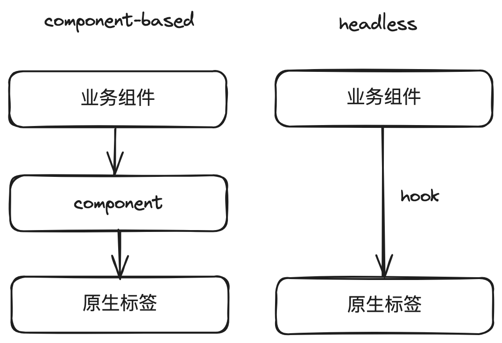

v8 
* demo
* hook 结合功能
* 实现原理 useReactTable 的输入输出
* antd table
* 从实现角度很向对比
* column 如何转化成 各个渲染 API
* 基本执行流程

2024/4/1
- [x] table
- [ ] column
- [ ] header
- [ ] row
- [ ] cell
- [ ] footer
- [ ] memo 的用法整理
- [ ] table-core 实现原理，执行流程，设计思路
- [ ] feature， virtualize
- [ ] nx
- [ ] rollup
- [ ] 

## 看前思考
@tanstack/react-table 是一个用于构建表格组件的 React 库。使用 @tanstack/react-table 的好处包括：

高性能：@tanstack/react-table 使用了虚拟滚动技术，可以有效地渲染大型表格数据，同时保持良好的性能。

易用性：@tanstack/react-table 提供了简洁的 API 和直观的接口，使得开发者在构建表格组件时更加方便。

定制性：@tanstack/react-table 允许开发者通过自定义渲染函数和插槽来轻松地定制表格的显示内容。

社区支持：@tanstack/react-table 有一个活跃的社区，开发者可以在社区中寻求帮助和分享经验。

源码

理解实现原理：阅读源码可以帮助你了解 @tanstack/react-table 的实现原理，包括虚拟滚动技术、渲染机制等，这有助于你更好地使用和定制这个库。

提高编程能力：阅读高质量的源码可以提高你的编程能力，特别是对数据结构和算法的理解。@tanstack/react-table 的源码质量较高，阅读它可以受益匪浅。

ts
state
hook

学习最佳实践：@tanstack/react-table 的源码中包含了大量的最佳实践，如代码结构、命名规范、性能优化等。阅读并学习这些最佳实践可以帮助你提高代码质量，并应用到其他项目中。

性能优化

参与社区贡献：如果你对 @tanstack/react-table 有改进建议或者发现了一些问题，可以通过阅读源码来提交 PR（Pull Request）或者报告 issue。这不仅可以提高社区参与度，还可以为其他用户提供更好的产品体验。

问题渠道

# 从实现上
## 概念
### headless libraries 和 component-based libraries
headless 

> Headless UI is a term for libraries and utilities that provide the logic, state, processing and API for UI elements and interactions, but do not provide markup, styles, or pre-built implementations.

简单说就是不提供样式，只提供逻辑和状态。

react-table 属于 headless libraries，例子如下。通过 `useReactTable` 钩子函数，和借用原生标签，即可实现表格功能。
``` js
const ReactTableDemo = () => {
  ...
  const table = useReactTable({
    data,
    columns,
    getCoreRowModel: getCoreRowModel(),
  });

  return (
    <div className="p-2">
      <table>
        <thead>
          {table.getHeaderGroups().map((headerGroup) => (
            <tr key={headerGroup.id}>
              {headerGroup.headers.map((header) => (
                <th key={header.id}>
                  {header.isPlaceholder
                    ? null
                    : (flexRender(
                        header.column.columnDef.header,
                        header.getContext()
                      ) as ReactNode)}
                </th>
              ))}
            </tr>
          ))}
        </thead>
        <tbody>
          {table.getRowModel().rows.map((row) => (
            <tr key={row.id}>
              {row.getVisibleCells().map((cell) => (
                <td key={cell.id}>
                  {
                    flexRender(
                      cell.column.columnDef.cell,
                      cell.getContext()
                    ) as ReactNode
                  }
                </td>
              ))}
            </tr>
          ))}
        </tbody>
        <tfoot>
          ...
        </tfoot>
      </table>
  )
}
```

component-based libraries，比如 antd，element-ui，vant，material-ui 等。



component-based libraries 提供了预先构建好的样式和组件，使用起来比较方便。
但是不够灵活，无法自定义样式，无法自定义组件。

headless libraries 提供了逻辑和状态，但是不提供样式和组件。相对灵活，但是也给样式复用带来了问题，比方说有些样式是固定的，这些样式该通过什么方式复用？
目前来看，tailwindcss + headless libraries 是我认为的一个比较好的组合。但是不符合国内前端开发的基本行情，因为国内前端开发基本都是基于组件的，大多是设计风格已经固定了，不会过多变动。


1. 定义`CoreTableState`接口，用于描述表格的核心状态。
2. 定义`CoreOptions`接口，用于描述表格的配置选项。其中，`getCoreRowModel`是一个函数，用于获取表格的核心行模型；`getRowId`是一个函数，用于获取行的ID；`getSubRows`是一个函数，用于获取行的子行数据。
3. 定义`CoreInstance`接口，用于描述表格实例。其中，`_features`是一个只读属性，用于存储表格的所有特性；`_getAllFlatColumnsById`是一个函数，用于获取所有平铺的列；`_getColumnDefs`是一个函数，用于获取列定义；`_getRowModel`是一个函数，用于获取表格的行模型；`_queue`是一个函数，用于将回调函数加入队列，以便稍后执行；`reset`是一个函数，用于重置表格状态；`setOptions`是一个函数，用于更新表格选项；`getState`是一个函数，用于获取表格当前状态；`setState`是一个函数，用于设置表格状态。
4. 定义`createTable`函数，用于创建表格实例。首先，合并内置特性和自定义特性；然后，创建核心实例，并为其添加特性；最后，将核心实例的属性赋值给表格实例。
5. 在`createTable`函数中，为表格实例添加`_getRowModel`、`_getAllColumns`、`_getAllFlatColumns`、`_getAllLeafColumns`和`_getColumn`等方法。这些方法主要用于获取表格的行模型、所有列、所有平铺的列、所有叶子列以及指定ID的列。
6. 在`createTable`函数中，调用每个特性的`createTable`方法，以便初始化特性。


getHeaderGroups header
getRowModel row
getFooterGroups header

有哪些主要要素
state
option
__feature
coreInstance


能不能打印

__feature
createColumn: (column, table) => {…}
createHeader: (header, table) => {…}
createTable: table => {…}
getDefaultColumnDef: () => { return defaultColumnSizing; }
getDefaultOptions: table => {…}
getInitialState: state => {…}


表格是二维，行和列
行 thead(，tbody (row)，tfoot,
列 column

useReactTable
data
column
  id
  header
  cell
  footer


基本执行流程
useReactTable
input
  data
  column
  options

output
 tableInstance

处理
  围绕 table 变量处理
  属性
    _features 
    mergeoption = defaultOptions + options
    initialState = feature.getInitialState + options.initialState
    构建 coreInstance
    _features.createTable

data 的处理
columns 的处理

getHeaderGroup

观点
看组件库源码，核心看变量，函数
变量：
常规变量 （无关渲染）
state 触发页面渲染

column
allColumns
leafColumns
leftColumns/centerColumns/centerColumns

解读
``` js
export function memo<TDeps extends readonly any[], TDepArgs, TResult>(
  getDeps: (depArgs?: TDepArgs) => [...TDeps],
  fn: (...args: NoInfer<[...TDeps]>) => TResult,
): (depArgs?: TDepArgs) => TResult {
  let deps: any[] = []
  let result: TResult | undefined

  return depArgs => {
    let depTime: number

    const newDeps = getDeps(depArgs)

    const depsChanged =
      newDeps.length !== deps.length ||
      newDeps.some((dep: any, index: number) => deps[index] !== dep)

    if (!depsChanged) {
      return result!
    }

    deps = newDeps

    let resultTime: number

    result = fn(...newDeps)

    return result!
  }
}
```


feature.getInitialState
feature.getDefaultColumnDef 默认情况下 column 的引用
feature.getDefaultOptions
feature?.createTable
feature.createColumn
feature.createCell
feature?.createRow
feature.createHeader


表格选择的三种状态
* all selected 所有子项都 selected
* all unselected 所有子项都不 selected
* some selected 部分子项 selected

all
row
subrow

结合 enableSubRowSelection
默认情况下 enableSubRowSelection 就是所有 row 都可以，
包含 row 的 leaf row

如果是 subrow selected
row 不能变为 unselected


如何提 pr
* 看 contributing.md
* Implement your changes and tests
* Commit your work and open a pull request